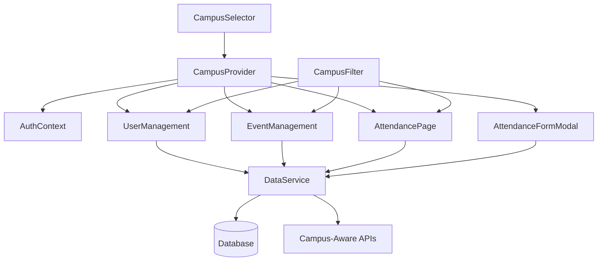

# Component Architecture

### New Components Required

#### **Campus Context Provider**
```typescript
interface CampusContextProps {
  currentCampus: Campus;
  availableCampuses: Campus[];
  userCampusPermissions: CampusPermissions;
  switchCampus: (campusId: number) => Promise<void>;
  getCampusById: (id: number) => Campus | null;
}

const CampusProvider: React.FC<{ children: React.ReactNode }> = ({ children }) => {
  // Campus context management logic
  // Integrates with existing AuthContext for user permissions
};
```

#### **Campus Selector Component**
```typescript
interface CampusSelectorProps {
  currentCampusId: number;
  availableCampuses: Campus[];
  onCampusChange: (campusId: number) => void;
  disabled?: boolean;
  compact?: boolean; // For header/mobile display
}

const CampusSelector: React.FC<CampusSelectorProps> = ({ ... }) => {
  // Campus selection dropdown with search and current campus display
  // Uses existing shadcn/ui Select component patterns
};
```

#### **Campus Filter Component**
```typescript
interface CampusFilterProps {
  selectedCampusIds: number[];
  onCampusFilterChange: (campusIds: number[]) => void;
  allowMultiSelect?: boolean; // Admin-only feature
  showAllOption?: boolean;
}

const CampusFilter: React.FC<CampusFilterProps> = ({ ... }) => {
  // Campus filtering for lists and tables
  // Extends existing FilterComponent patterns
};
```

### Enhanced Existing Components

#### **UserManagement.jsx Enhancement**
**Integration Points:**
- Add campus context to user creation/editing forms
- Campus-based user filtering in table
- Campus column in user table display
- Campus-aware user assignment validation

**Key Changes:**
```typescript
// Add to existing form data state
const [formData, setFormData] = useState({
  // ... existing fields
  campusId: user?.campusId || 1, // Default to Main Campus
});

// Enhanced user table columns
const userTableColumns = [
  // ... existing columns
  {
    key: "campus",
    header: "Campus", 
    render: (user) => <CampusBadge campusId={user.campusId} />
  }
];
```

#### **EventManagement.jsx Enhancement**
**Integration Points:**
- Campus context in event creation forms
- Campus-based event filtering and display
- Campus validation for event location
- Cross-campus event permissions (admin only)

**Key Changes:**
```typescript
// Add to existing form data state
const [formData, setFormData] = useState({
  // ... existing fields
  campusId: user?.campusId || 1,
  isMultiCampus: false,
  allowedCampuses: [],
});

// Enhanced event filtering with campus context
const eventFilterConfig = useMemo(() => 
  createEventFilterConfig(eventsList, user?.campusId), 
  [eventsList, user?.campusId]
);
```

#### **AttendancePage.jsx Enhancement**
**Integration Points:**
- Campus-segmented attendance statistics
- Campus filtering in attendance records
- Campus context in attendance form modal
- Campus-based analytics and reporting

**Key Changes:**
```typescript
// Enhanced statistics with campus breakdown
const stats = useMemo(() => {
  // ... existing stats calculation
  // Add campus-specific statistics
  byCampus: calculateCampusStats(attendanceList),
  currentCampusStats: filterByCampus(attendanceList, user?.campusId)
}, [attendanceList, user?.campusId]);
```

#### **AttendanceFormModal.jsx Enhancement**
**Integration Points:**
- Campus context validation for attendance
- Campus-specific department/course loading
- Campus location verification
- Campus-aware user data pre-population

**Key Changes:**
```typescript
// Campus-aware department loading
const departments = useMemo(() => 
  universityData.campuses
    .find(c => c.id === user?.campusId)?.departments || [],
  [user?.campusId]
);

// Campus validation in form submission
const validateCampusContext = (formData) => {
  // Ensure user can only submit attendance for their assigned campus
  return formData.campusId === user?.campusId || user?.role === 'admin';
};
```

### Component Integration Strategy

#### **Context Propagation Pattern**
```typescript
// App.jsx - Root level campus context
function App() {
  return (
    <AuthProvider>
      <CampusProvider> {/* New campus context layer */}
        <ModalProvider>
          <DataPreloadProvider>
            {/* Existing app structure */}
          </DataPreloadProvider>
        </ModalProvider>
      </CampusProvider>
    </AuthProvider>
  );
}
```

#### **Data Flow Enhancement**
```typescript
// Service layer campus context injection
interface ServiceContext {
  userId: number;
  userRole: string;
  userCampusId: number; // New campus context
  requestedCampusId?: number; // For cross-campus operations
}

// Component props campus enhancement
interface ComponentProps {
  // ... existing props
  campusContext?: {
    currentCampusId: number;
    allowCrossCampus: boolean;
  };
}
```

#### **Filtering Enhancement Pattern**
```typescript
// Existing filter configs enhanced with campus awareness
export const createUserFilterConfig = (users = [], currentCampusId = null) => [
  // ... existing filters
  {
    id: "campus",
    label: "Campus",
    type: "select",
    field: "campusId",
    value: currentCampusId || "",
    options: [
      { value: "", label: "All Campuses" }, // Admin only
      ...CAMPUSES.map(campus => ({ 
        value: campus.id, 
        label: campus.name 
      }))
    ],
    adminOnly: true // Hide for non-admin users
  }
];
```

### Component Interaction Diagram



### Campus-Aware Routing

#### **Route Enhancement Strategy**
```typescript
// Enhanced route structure with campus context
const routes = [
  {
    path: "/management",
    element: <ManagementPage />,
    campusAware: true, // Enable campus filtering
    permissions: ["admin", "organizer"]
  },
  {
    path: "/attendance",
    element: <AttendancePage />,
    campusAware: true,
    permissions: ["admin", "organizer", "student"]
  }
];

// Route-level campus context injection
const CampusAwareRoute = ({ element, campusAware, ...props }) => {
  const { userCampusId } = useCampusContext();
  
  if (campusAware) {
    return React.cloneElement(element, { 
      ...props, 
      campusContext: { currentCampusId: userCampusId } 
    });
  }
  
  return element;
};
```

**This component architecture strategy leverages existing React patterns while seamlessly integrating campus context throughout the application. The approach ensures minimal disruption to existing components while providing comprehensive multi-campus functionality.**

