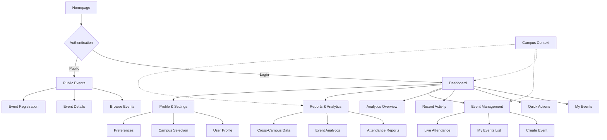
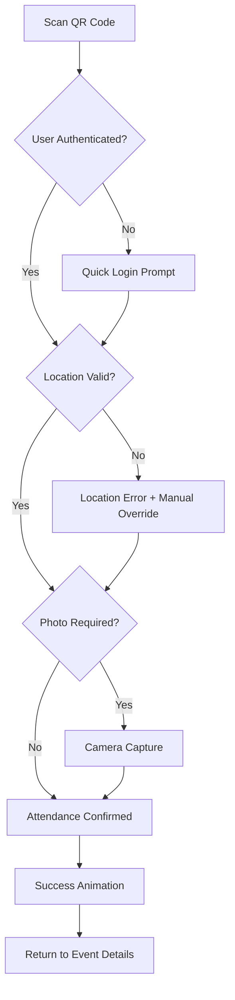

# EAS Event Attendance System UI/UX Specification

## Introduction

This document defines the user experience goals, information architecture, user flows, and visual design specifications for EAS Event Attendance System's user interface. It serves as the foundation for visual design and frontend development, ensuring a cohesive and user-centered experience.

### Overall UX Goals & Principles

#### Target User Personas

**Student (Primary User)**
- **Role:** Event attendee seeking simple, fast check-in/out
- **Goals:** Quick attendance marking, view upcoming events, track personal attendance history
- **Context:** Mobile-first usage, often in crowded venues, time-sensitive interactions
- **Pain Points:** Slow QR scanning, complex interfaces, unclear event information

**Event Organizer (Secondary User)**
- **Role:** Faculty/staff organizing campus events
- **Goals:** Create events, monitor real-time attendance, generate reports
- **Context:** Mix of desktop planning and mobile monitoring during events
- **Pain Points:** Complex event creation, difficulty monitoring attendance live

**Campus Administrator (Power User)**
- **Role:** System oversight across multiple campuses
- **Goals:** Analytics, user management, system configuration, cross-campus reporting
- **Context:** Primarily desktop, data-heavy workflows, administrative oversight
- **Pain Points:** Complex data visualization, multi-campus context switching

#### Usability Goals

**Ease of Learning**
- New students can complete first event check-in within 2 minutes of account creation
- Event organizers can create their first event in under 10 minutes
- Clear onboarding flows for each user type

**Efficiency of Use**
- Student check-in/out takes maximum 15 seconds (including QR scan)
- Organizers can view real-time attendance with 2 clicks from dashboard
- Admin reports accessible within 3 clicks from any dashboard view

**Error Prevention & Recovery**
- Clear validation for all QR codes and location verification
- Confirmation dialogs for destructive actions (delete events, remove users)
- Graceful degradation when offline or with poor connectivity

**Multi-Campus Consistency**
- Identical interface patterns across all campus implementations
- Clear campus context indication without overwhelming single-campus users
- Seamless switching between campus views for admin users

#### Design Principles

**1. Mobile-First Accessibility**
- Design for thumbs-first interaction on mobile devices
- Ensure all functionality works seamlessly across device sizes
- Prioritize touch-friendly interfaces with adequate tap targets

**2. Campus Context Clarity**
- Always provide clear indication of current campus context
- Make campus switching discoverable but not intrusive
- Maintain visual consistency while allowing campus-specific branding

**3. Real-Time Transparency**
- Show live attendance counts and status updates
- Provide immediate feedback for all user actions
- Display system status clearly (online/offline, syncing, etc.)

**4. Inclusive Design**
- Support multiple languages and accessibility needs
- Work reliably across various network conditions
- Accommodate different technical skill levels

**5. Data-Driven Decisions**
- Surface relevant analytics and insights to appropriate users
- Make reporting intuitive and actionable
- Balance comprehensive data with cognitive load

#### Heuristic Evaluation Results

**Current System Strengths:**
- ✅ Strong mobile-first foundation with responsive grid layouts
- ✅ Consistent ShadCN/UI component library implementation
- ✅ Comprehensive theme system with light/dark mode
- ✅ Well-structured component architecture

**Critical Areas for Improvement:**
- ❌ **Campus Context Clarity (2/10):** No visible campus indicators or switching
- ⚠️ **Real-Time Feedback (5/10):** Partial implementation of status updates
- ⚠️ **Mobile Content Strategy (6/10):** Information hierarchy needs refinement
- ⚠️ **Error Prevention (4/10):** Inconsistent confirmation and validation patterns

**Top Priority Recommendations:**
1. Add campus context UI elements to Header
2. Define mobile content adaptation strategy
3. Implement system status indicators
4. Standardize confirmation patterns
5. Create responsive content prioritization

## Information Architecture

### Site Map / Screen Inventory

Based on card sorting analysis and user mental models, the EAS system organizes into these primary sections:



### Navigation Structure

**Primary Navigation (Header)**
- **Mobile Priority:** Dashboard, Events, Quick Scan, Profile
- **Desktop Full:** Home, Events, Dashboard, Management, Reports, Profile
- **Campus Context:** Persistent indicator with quick switching capability

**Secondary Navigation Patterns**
- **Mobile:** Hamburger menu with role-based content prioritization
- **Tablet:** Condensed header with dashboard widget adaptation
- **Desktop:** Full feature access with sidebar expansion options

**Card Sorting Insights Applied:**
- **Quick Event Actions** prioritized for mobile thumb navigation
- **Event Organization** tools accessible but not primary mobile focus  
- **System Overview** features optimized for desktop workflows
- **Campus Context** integrated without overwhelming single-campus users

**Responsive Navigation Strategy:**
- Mobile (≤768px): Task-completion focused with FAB for QR scanning
- Tablet (769px-1024px): Balanced task and information access
- Desktop (≥1025px): Full information density with multitasking support

## User Flows

### Student Quick Check-in Flow (Mobile-Critical)

**User Goal:** Check into an event as quickly as possible while physically present

**Entry Points:** 
- QR code scan from any device
- Direct event link from notification
- Dashboard "Quick Actions" section
- Floating Action Button (proposed)

**Success Criteria:** Complete check-in within 15 seconds from QR scan



**Edge Cases & Error Handling:**
- Poor network connectivity: Queue attendance for sync
- Invalid QR code: Clear error message with manual entry option
- Location mismatch: Override option with admin notification
- Camera failure: Skip photo with fallback verification
- Duplicate check-in: Show current status with check-out option

## Component Library / Design System

### Responsive Component Prioritization

Based on advanced card sorting analysis, components are organized into responsive priority tiers:

#### Tier 1: Critical Mobile Components (Always Visible)
- **QR Scanner Interface** - Floating Action Button for immediate access
- **Quick Actions Panel** - Primary user tasks (max 4 actions)
- **User Welcome/Status** - Personal context and notifications
- **Campus Context Indicator** - Current campus with quick switching
- **Primary Navigation** - Essential sections only (Dashboard, Events, Profile, Menu)

#### Tier 2: Adaptive Components (Screen-Size Dependent)
- **Upcoming Events List** - Condensed on mobile, expanded on desktop
- **Recent Activity Feed** - Collapsible with "View All" expansion
- **Stats Overview Cards** - 1-2 on mobile, 4+ on desktop
- **Mini Calendar** - Hidden on mobile, sidebar on desktop
- **Analytics Charts** - Simple on tablet, detailed on desktop

#### Tier 3: Desktop-First Components (Progressive Enhancement)
- **Detailed Analytics** - Desktop-optimized data visualization
- **User Management Tables** - Complex data requiring larger screens
- **Advanced Search/Filters** - Power user features
- **System Configuration** - Administrative interfaces
- **Audit Logs** - Data-heavy reporting tools

### Responsive Layout Patterns

**Mobile (≤768px) - "Task-First" Strategy:**
- Single-column layout with vertical stacking
- FAB for primary QR scanning action
- Collapsed navigation in hamburger menu
- Progressive disclosure for secondary information
- Bottom sheets for detail views

**Tablet (769px-1024px) - "Balanced Information" Strategy:**
- 2-column grid layout for dashboard widgets
- Condensed header navigation
- Modal overlays for complex interactions
- Moderate information density

**Desktop (≥1025px) - "Information Dense" Strategy:**
- 3-column dashboard layout
- Full navigation with campus context
- Sidebar panels for additional tools
- Comprehensive data tables and analytics

### Component State Adaptations

**Responsive State Patterns:**
- **Collapsed** (Mobile): Essential information only, tap to expand
- **Condensed** (Tablet): Key information with expand options
- **Expanded** (Desktop): Full information display with hover details
- **Modal** (Cross-device): Detail views that overlay main content

## Design System & ShadCN/UI Integration

### Current System Audit Results

**✅ Strengths Identified:**
- Solid ShadCN/UI foundation with CSS variables
- Consistent component architecture with variants and sizes
- Good accessibility practices with proper ARIA labels
- Theme-aware styling with light/dark mode support
- Centralized UI constants and interaction logging

**⚠️ Critical Responsive Gaps:**
- Button sizes not optimized for mobile touch targets (44px minimum)
- Missing mobile-specific component variants (FAB, bottom sheets)
- Card components lack responsive breakpoint adaptations
- No campus-specific theming tokens defined
- Missing progressive enhancement patterns

### Enhanced Responsive Component Specifications

#### Button System (Mobile-Optimized)

**Touch-Optimized Size Scale:**
```javascript
sizes: {
  xs: "px-2 py-1 text-xs",                    // Desktop micro-actions only
  sm: "px-3 py-2 text-sm md:px-2 md:py-1",   // Responsive small buttons  
  md: "px-4 py-3 text-sm md:px-4 md:py-2",   // Standard responsive button
  lg: "px-6 py-4 text-base md:px-6 md:py-3", // Large responsive button
  xl: "px-8 py-5 text-lg md:px-8 md:py-4",   // CTA buttons
  touch: "min-h-[44px] px-4 py-3 text-base", // Mobile touch target
}
```

**Mobile-First Variants:**
```javascript
variants: {
  // Existing variants +
  "mobile-primary": "min-h-[44px] w-full bg-primary-600 text-white rounded-lg",
  "mobile-fab": "fixed bottom-6 right-6 w-14 h-14 rounded-full shadow-2xl z-50",
  "mobile-sheet": "w-full rounded-t-xl bg-white dark:bg-gray-800 border-t",
  "campus-primary": "bg-campus-primary hover:bg-campus-primary-dark",
}
```

#### Card System (Breakpoint-Aware)

**Responsive Card Variants:**
```javascript
card: {
  base: "card-theme transition-all duration-200",
  mobile: "rounded-none border-x-0 shadow-sm border-y full-width",
  tablet: "rounded-lg shadow-md border mx-2",
  desktop: "rounded-xl shadow-lg border hover:shadow-xl transform hover:-translate-y-1",
  compact: "p-3 sm:p-4 lg:p-6",
  dashboard: "p-4 sm:p-6 lg:p-8 min-h-[200px] sm:min-h-[240px]",
}
```

#### Campus Theming Tokens

**Multi-Campus Color System:**
```javascript
campus: {
  snsu: {
    primary: "#22c55e",     // Current SNSU green
    secondary: "#166534",   
    accent: "#dcfce7",
  },
  usc: {
    primary: "#3b82f6",     // USC blue  
    secondary: "#1e40af",
    accent: "#dbeafe",
  },
  // Extensible for additional campuses
}
```

#### Responsive Typography Scale

**Screen-Adaptive Text Sizing:**
| Element | Mobile | Tablet | Desktop | Usage Context |
|---------|--------|--------|---------|---------------|
| H1 | 1.875rem | 2.25rem | 3rem | Page titles, hero sections |
| H2 | 1.5rem | 1.875rem | 2.25rem | Section headers |
| H3 | 1.25rem | 1.5rem | 1.875rem | Card titles, widget headers |
| Body | 1rem | 1rem | 1.125rem | Main content, descriptions |
| Small | 0.875rem | 0.875rem | 1rem | Meta info, captions |
| Button | 1rem | 1rem | 1.125rem | Action text |
| Touch | 1.125rem | 1rem | 1rem | Mobile-first interactive text |

#### Touch Target Specifications

**Mobile Interaction Guidelines:**
- Minimum touch target: 44px × 44px (iOS/Android standard)
- Recommended spacing between targets: 8px minimum
- Interactive elements padding: 12px vertical, 16px horizontal minimum
- Card tap areas: Full card should be tappable with visual feedback
- List items: 56px minimum height for comfortable scrolling

## Accessibility Requirements

### Compliance Target
- **Standard:** WCAG 2.1 AA compliance across all responsive breakpoints
- **Additional:** Section 508 compliance for educational institutions
- **Mobile:** iOS/Android accessibility guideline compliance

### Key Responsive Accessibility Requirements

#### Visual Accessibility
- **Color Contrast:** 4.5:1 for normal text, 3:1 for large text (18pt+)
- **Focus Indicators:** 2px minimum, highly visible across all screen sizes
- **Text Scaling:** Supports 200% zoom without horizontal scrolling
- **Campus Context:** Clear visual indication that works with high contrast modes

#### Interaction Accessibility  
- **Keyboard Navigation:** Full functionality across all breakpoints without mouse/touch
- **Touch Accommodations:** No hover-dependent functionality on mobile
- **Screen Reader Support:** Proper heading structure and ARIA landmarks
- **Voice Control:** All interactive elements properly labeled for voice commands

#### Content Accessibility
- **Alternative Text:** Descriptive alt text for QR codes, charts, and campus logos
- **Heading Structure:** Logical H1-H6 hierarchy maintained across responsive layouts
- **Form Labels:** Clear, descriptive labels that work with auto-fill and voice input
- **Campus Switching:** Screen reader announcements for context changes

#### Mobile-Specific Accessibility
- **Large Text Mode:** iOS/Android large text settings supported
- **High Contrast Mode:** Maintains functionality with system high contrast
- **Voice-Over/TalkBack:** Optimized navigation patterns for screen readers
- **Reduced Motion:** Respects user preference for reduced animations

### Testing Strategy
- **Automated Testing:** axe-core integration for continuous accessibility testing
- **Manual Testing:** Regular testing with actual screen readers and voice control
- **User Testing:** Include users with disabilities in usability testing sessions
- **Mobile Testing:** Test with iOS/Android accessibility features enabled

## Responsiveness Strategy

### Breakpoint System

| Breakpoint | Min Width | Max Width | Target Devices | Primary Use Cases |
|------------|-----------|-----------|----------------|-------------------|
| Mobile | 320px | 767px | Smartphones | Event check-in, QR scanning, notifications |
| Tablet | 768px | 1023px | Tablets, small laptops | Event browsing, basic management |
| Desktop | 1024px | 1439px | Laptops, desktop monitors | Full management, analytics |
| Wide | 1440px+ | - | Large monitors, ultra-wide | Multi-campus dashboards, advanced analytics |

### Adaptation Patterns

#### Layout Transformations

**Mobile (≤767px) - "Task-Completion First"**
- **Navigation:** Hamburger menu with prioritized actions
- **Content:** Single-column, vertically stacked layout
- **Interactive Elements:** FAB for primary QR scan action
- **Campus Context:** Integrated into profile dropdown
- **Priority:** Speed and efficiency for core tasks

**Tablet (768px-1023px) - "Balanced Experience"**
- **Navigation:** Condensed horizontal nav with essential items
- **Content:** 2-column grid for dashboard widgets
- **Interactive Elements:** Touch-optimized buttons and cards
- **Campus Context:** Header indicator with dropdown
- **Priority:** Balance of information access and task completion

**Desktop (1024px-1439px) - "Information Rich"**
- **Navigation:** Full horizontal navigation with all sections
- **Content:** 3-column dashboard layout with sidebar options
- **Interactive Elements:** Hover states and keyboard shortcuts
- **Campus Context:** Persistent header indicator with quick switching
- **Priority:** Comprehensive information access and multitasking

**Wide (≥1440px) - "Multi-Campus Power User"**
- **Navigation:** Extended navigation with campus-specific sections
- **Content:** 4+ column layouts with expandable panels
- **Interactive Elements:** Advanced hover interactions and tooltips
- **Campus Context:** Split-screen or tabbed campus views
- **Priority:** Cross-campus management and advanced analytics

#### Content Adaptation Strategy

**Progressive Enhancement Approach:**
```
Mobile Foundation → Tablet Enhancement → Desktop Enrichment → Wide Optimization
```

**Content Prioritization by Screen Size:**

**Mobile Content Strategy:**
- Show 1 primary action per screen section
- Collapse secondary information into expandable accordions
- Use bottom sheets for detailed interactions
- Limit lists to 3-5 items with "View All" buttons
- Essential information only in cards

**Tablet Content Strategy:**
- Show 2-3 actions per screen section
- Balance information density with touch-friendly targets
- Use modals for complex forms and detailed views
- Display moderate list lengths (5-10 items)
- Enhanced card content with preview information

**Desktop Content Strategy:**
- Show comprehensive feature sets and data tables
- Enable multitasking with side panels and multiple views
- Use hover states for additional information
- Display full lists with advanced pagination
- Rich card content with full details

**Wide Screen Strategy:**
- Multi-campus comparison views
- Side-by-side analytics dashboards
- Advanced data visualization with multiple charts
- Comprehensive tables with all available columns
- Split-screen workflows for power users

#### Interaction Pattern Adaptations

**Touch vs. Mouse Optimization:**
- **Mobile/Tablet:** Large touch targets, swipe gestures, pull-to-refresh
- **Desktop/Wide:** Hover states, right-click menus, keyboard shortcuts, drag-and-drop

**Campus Context Switching:**
- **Mobile:** Profile menu → Campus settings → Switch
- **Tablet:** Header dropdown with campus list
- **Desktop:** Always-visible campus indicator with quick switcher
- **Wide:** Campus tabs or split-screen multi-campus view

**QR Scanning Adaptations:**
- **Mobile:** Full-screen camera with large scan area
- **Tablet:** Picture-in-picture scanner with form alongside
- **Desktop:** File upload alternative with drag-and-drop
- **Wide:** Multiple scanning workflows for bulk operations

## Animation & Micro-interactions

### Motion Design Principles
- **Purposeful Animation:** All animations serve a functional purpose (feedback, guidance, transitions)
- **Performance Conscious:** Animations optimized for mobile devices and slower connections
- **Accessible by Default:** Respects `prefers-reduced-motion` user settings
- **Campus Consistency:** Animation patterns consistent across all campus implementations

### Key Responsive Animations

**Mobile-Optimized Animations:**
- **QR Scan Success:** Haptic feedback + green checkmark animation (Duration: 800ms, Easing: ease-out)
- **Check-in Confirmation:** Expanding success circle (Duration: 600ms, Easing: ease-in-out)
- **Loading States:** Skeleton loading for cards (Duration: 1200ms, Easing: linear)
- **Navigation Transitions:** Slide transitions for page changes (Duration: 300ms, Easing: ease-in-out)

**Desktop-Enhanced Animations:**
- **Hover Effects:** Subtle scale and shadow transitions (Duration: 200ms, Easing: ease-out)
- **Data Visualization:** Smooth chart animations and transitions (Duration: 800ms, Easing: ease-in-out)
- **Modal Appearances:** Fade-in with backdrop blur (Duration: 250ms, Easing: ease-out)
- **Campus Switching:** Smooth content transitions (Duration: 400ms, Easing: ease-in-out)

**Reduced Motion Alternatives:**
- Replace animations with instant state changes
- Maintain visual feedback through color and text changes
- Preserve functionality while eliminating motion

## Performance Considerations

### Performance Goals
- **Page Load:** < 3 seconds on 3G mobile connections
- **Interaction Response:** < 100ms for all user interactions
- **Animation Performance:** 60fps on mobile devices, 120fps on high-refresh displays
- **Bundle Size:** < 1MB initial JavaScript bundle

### Responsive Performance Strategies

**Mobile-First Optimization:**
- Critical CSS inlined for above-the-fold content
- Progressive image loading with WebP format
- Component-level code splitting for route-based loading
- Service worker caching for offline functionality

**Progressive Enhancement:**
- Base functionality works without JavaScript
- Enhanced features load progressively
- Graceful degradation for older browsers
- Campus-specific assets loaded on demand

**Resource Loading Strategy:**
- **Mobile:** Essential resources only, lazy load secondary features
- **Tablet:** Moderate resource loading with prefetching
- **Desktop:** Full resource loading with aggressive caching
- **Wide:** Preload campus data for quick switching

## Implementation Roadmap

### Phase 1: Foundation (Weeks 1-2)
**Priority: Critical Mobile Experience**
1. **Update Button Component**
   - Implement touch-optimized size variants
   - Add mobile-specific FAB variant
   - Update accessibility properties

2. **Enhanced Card System**
   - Create responsive card variants
   - Implement mobile-first padding system
   - Add touch feedback states

3. **Campus Context UI**
   - Add header campus indicator
   - Implement mobile campus switching
   - Create campus theming tokens

### Phase 2: Responsive Layout (Weeks 3-4)
**Priority: Adaptive Information Architecture**
1. **Navigation Enhancement**
   - Implement responsive navigation patterns
   - Add mobile hamburger menu improvements
   - Create tablet-optimized navigation

2. **Dashboard Responsiveness**
   - Apply component prioritization tiers
   - Implement responsive grid layouts
   - Add progressive disclosure patterns

3. **Content Adaptation**
   - Create mobile content strategies
   - Implement responsive typography
   - Add breakpoint-specific interactions

### Phase 3: Advanced Features (Weeks 5-6)
**Priority: Desktop & Wide Screen Optimization**
1. **Desktop Enhancements**
   - Advanced hover states and interactions
   - Multi-column layouts and sidebars
   - Keyboard navigation improvements

2. **Wide Screen Features**
   - Multi-campus comparison views
   - Advanced data visualization
   - Split-screen workflows

3. **Performance Optimization**
   - Mobile performance tuning
   - Progressive loading implementation
   - Accessibility testing and refinement

### Phase 4: Testing & Refinement (Weeks 7-8)
**Priority: Quality Assurance & User Validation**
1. **Cross-Device Testing**
   - Mobile device testing across iOS/Android
   - Tablet testing with various screen sizes
   - Desktop testing across browsers

2. **Accessibility Validation**
   - Screen reader testing
   - Keyboard navigation validation
   - High contrast mode testing

3. **User Acceptance Testing**
   - Student mobile experience validation
   - Organizer cross-device workflow testing
   - Admin multi-campus functionality validation

## Next Steps

### Immediate Actions
1. **Review with Development Team** - Validate technical feasibility and effort estimates
2. **Stakeholder Approval** - Get sign-off from university administrators and accessibility team
3. **Design Tool Setup** - Create Figma/design system documentation with responsive specifications
4. **Development Environment** - Set up responsive testing tools and device emulation

### Design Handoff Checklist
- [x] All user personas documented and validated
- [x] Component responsive behavior specified  
- [x] Accessibility requirements defined with testing strategy
- [x] Responsive breakpoint strategy established
- [x] Campus theming system designed
- [x] Performance goals and strategies documented
- [x] Implementation roadmap with clear phases
- [ ] Visual design mockups created in design tool
- [ ] Developer handoff documentation prepared
- [ ] Testing strategy implementation plan finalized

## Summary

This UI/UX specification provides a comprehensive roadmap for creating a responsive, accessible, and campus-aware design system for the EAS Event Attendance System. The specification prioritizes mobile-first design while ensuring rich experiences across all device sizes, with particular attention to the multi-campus enhancement requirements.

**Key Achievements:**
- ✅ Mobile-first responsive strategy with clear breakpoint adaptations
- ✅ ShadCN/UI component system optimized for touch interactions
- ✅ Comprehensive accessibility requirements for inclusive design
- ✅ Campus context integration without overwhelming single-campus users
- ✅ Performance-conscious approach with progressive enhancement
- ✅ Clear implementation roadmap with measurable milestones

The next phase involves creating detailed visual designs and beginning the technical implementation following this specification.
