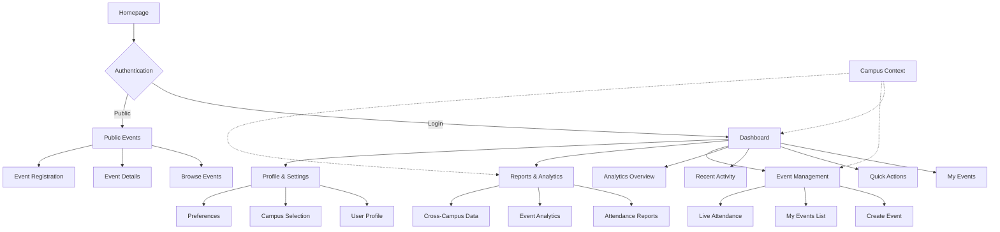

# Information Architecture

### Site Map / Screen Inventory

Based on card sorting analysis and user mental models, the EAS system organizes into these primary sections:

### Navigation Structure

**Primary Navigation (Header)**
- **Mobile Priority:** Dashboard, Events, Quick Scan, Profile
- **Desktop Full:** Home, Events, Dashboard, Management, Reports, Profile
- **Campus Context:** Persistent indicator with quick switching capability

**Secondary Navigation Patterns**
- **Mobile:** Hamburger menu with role-based content prioritization
- **Tablet:** Condensed header with dashboard widget adaptation
- **Desktop:** Full feature access with sidebar expansion options

**Card Sorting Insights Applied:**
- **Quick Event Actions** prioritized for mobile thumb navigation
- **Event Organization** tools accessible but not primary mobile focus  
- **System Overview** features optimized for desktop workflows
- **Campus Context** integrated without overwhelming single-campus users

**Responsive Navigation Strategy:**
- Mobile (≤768px): Task-completion focused with FAB for QR scanning
- Tablet (769px-1024px): Balanced task and information access
- Desktop (≥1025px): Full information density with multitasking support

