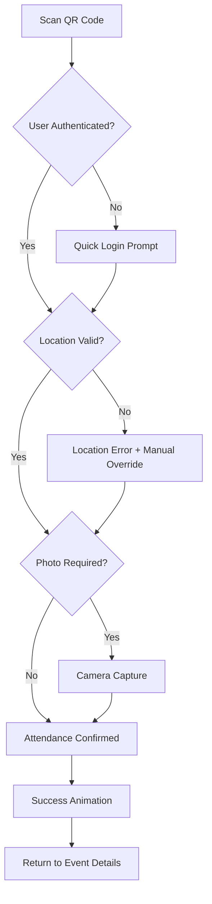

# User Flows

### Student Quick Check-in Flow (Mobile-Critical)

**User Goal:** Check into an event as quickly as possible while physically present

**Entry Points:** 
- QR code scan from any device
- Direct event link from notification
- Dashboard "Quick Actions" section
- Floating Action Button (proposed)

**Success Criteria:** Complete check-in within 15 seconds from QR scan

**Edge Cases & Error Handling:**
- Poor network connectivity: Queue attendance for sync
- Invalid QR code: Clear error message with manual entry option
- Location mismatch: Override option with admin notification
- Camera failure: Skip photo with fallback verification
- Duplicate check-in: Show current status with check-out option

